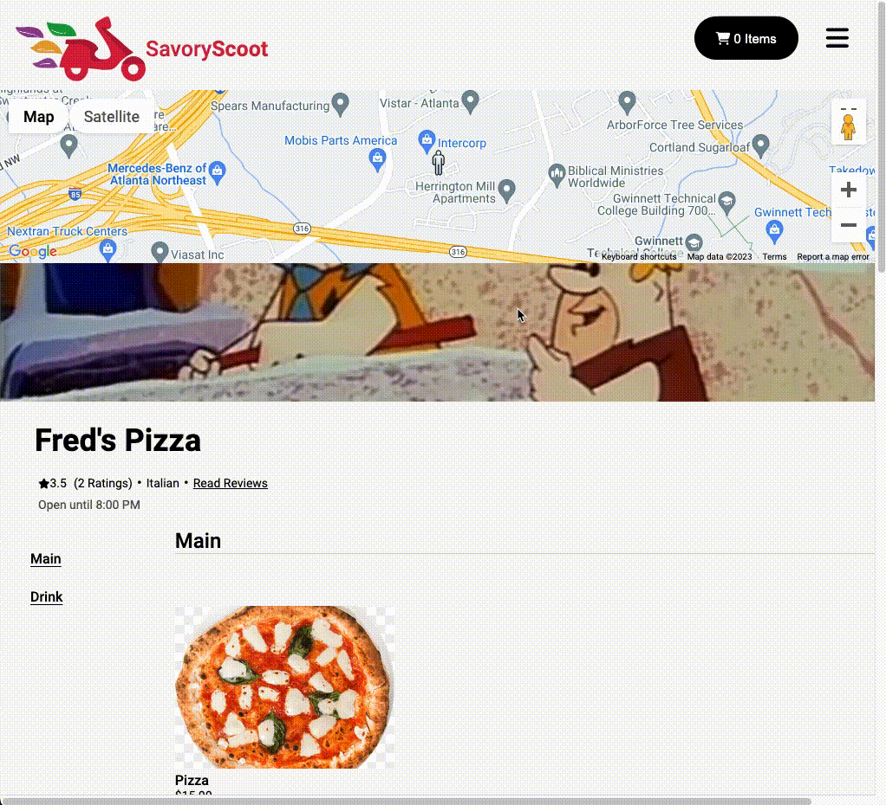

# Savory Scoot

## Live Link

[https://savoryscoot.onrender.com/](https://savoryscoot.onrender.com/)

### Technologies used

#### Frameworks/Languages

#### Database

#### Other Tools

#### Hosting

## Submitting an Order

## Submitting a Review

## Endpoints

### Auth

| Route                                                | Purpose                                             | Output                                                                                                                                                                                              |
| ---------------------------------------------------- | --------------------------------------------------- | --------------------------------------------------------------------------------------------------------------------------------------------------------------------------------------------------- |
| `GET /api/auth/`                                     | Authenticates a user                                | `{"address": <STRING/>, "birthday": <STRING/>, "email": <STRING/>, "username":<STRING/> ,"id": <INT/>, "first_name": <STRING/>, "last_name": <STRING/>, "orders": [<orders/>]}`                     |
| `POST /api/auth/login`                               | Logs a user in                                      | `{"address": <STRING/>, "birthday": <STRING/>, "email": <STRING/>, "username":<STRING/> ,"id": <INT/>, "first_name": <STRING/>, "last_name": <STRING/>, "orders": [<orders/>]}`                     |
| `GET /api/auth/logout`                               | Logs a user out                                     | `{"message": "User logged out"}`                                                                                                                                                                    |
| `POST /api/auth/signup`                              | Creates a new user and logs them in                 | `{"address": <STRING/>, "birthday": <STRING/>, "email": <STRING/>, "username":<STRING/> ,"id": <INT/>, "first_name": <STRING/>, "last_name": <STRING/>, "orders": [<orders/>]}`                     |
| `GET /api/auth/unauthorized`                         | Returns unauthorized JSON when authentication fails | `{"errors": ["Unauthorized"]}`                                                                                                                                                                      |

### Restaurants and Items

| Route                                                | Purpose                                             | Output                                                                                                                                                                                              |
| ---------------------------------------------------- | --------------------------------------------------- | --------------------------------------------------------------------------------------------------------------------------------------------------------------------------------------------------- |
| `GET /api/items/<int:itemId>`                        | Fetches specific item by ID                         | `{"category": <STRING/>, "description": <STRING/>, "id": <INT/>, "is_alcohol": <BOOLEAN/>, "name", <STRING/>, "preview_img", <URL/>, "price": <FLOAT/>, "restaurant_id": <INT/>, "orders", <INT/>}` |
| `POST /api/restaurants`                              | Posts a restaurant                                  | `{"id": <INT/>, "name": <STRING/>, "category": <STRING/>, "address": <STRING/>, "city": <STRING/>, "state": <STRING/>, "hours_open": <STRING/>, "hours_close": <STRING/>, "reviews":[<reviews/>], "items": [<items/>], "orders": [<orders/>]}`|
| `DELETE /api/restaurants/<int:restaurantId>`         | Deletes a restaurant by ID                          |`{"message": "Success"}`                                                                                                                                                                              |
| `POST /api/restaurants/<int:restaurantId>/items/new` | Creates an item for a restaurant                    |`{"category": <STRING/>, "description": <STRING/>, "id": <INT/>, "is_alcohol": <BOOLEAN/>, "name", <STRING/>, "preview_img", <URL/>, "price": <FLOAT/>, "restaurant_id": <INT/>, "orders", <INT/>}`  |
| `POST /api/restaurants/<int:restaurantId>/orders`    | Creates a new order for a restaurant                |`{"id": <INT/>, "user_id": <INT/>, "created_at": <DATETIME/>, "is_complete": <BOOLEAN/>, "address": <STRING/>, "price": <FLOAT/>, "restaurant_id": <INT/>, "notes": <STRING/>, "items":[<items/>]}`  |
| `POST /api/restaurants/<int:restaurantId>/reviews`   | Posts a review for a restaurant                     |`{"id": <INT/>, "user_id": <INT/>, "restaurant_id": <INT/>, "review": <STRING/>, "stars": <INT 1-5/>, "created_at": <DATETIME/>}`                                                                    |

### User Actions

| Route                                                | Purpose                                             | Output                                                                                                                                                                                              |
| ---------------------------------------------------- | --------------------------------------------------- | --------------------------------------------------------------------------------------------------------------------------------------------------------------------------------------------------- |
| `DELETE /api/reviews/<int:reviewId>`                 | Deletes a review by ID                              |`{"message": "Success"}`                                                                                                                                                                              |
| `POST /api/users/<int:id>`                           | Updates a user by their ID                          |`{"address": <STRING/>, "birthday": <STRING/>, "email": <STRING/>, "username":<STRING/> ,"id": <INT/>, "first_name": <STRING/>, "last_name": <STRING/>, "orders": [<orders/>]}`                      |
| `DELETE /api/users/current`                          | Deletes the current user                            |`{"message": "Success"}`                                                                                                                                                                              |
